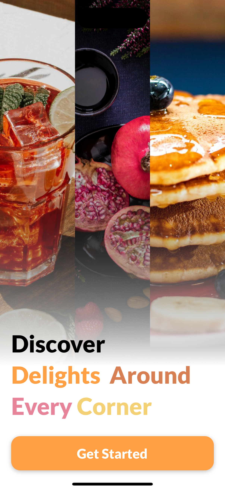
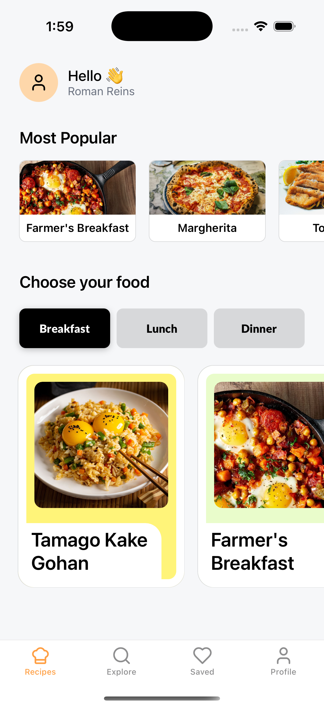
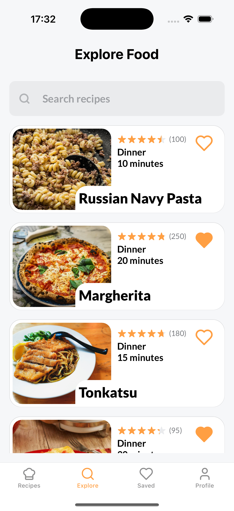
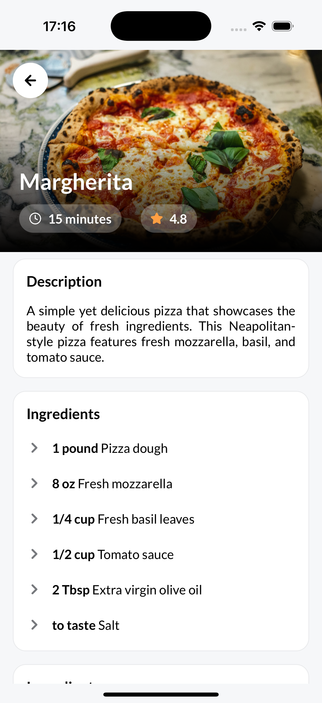
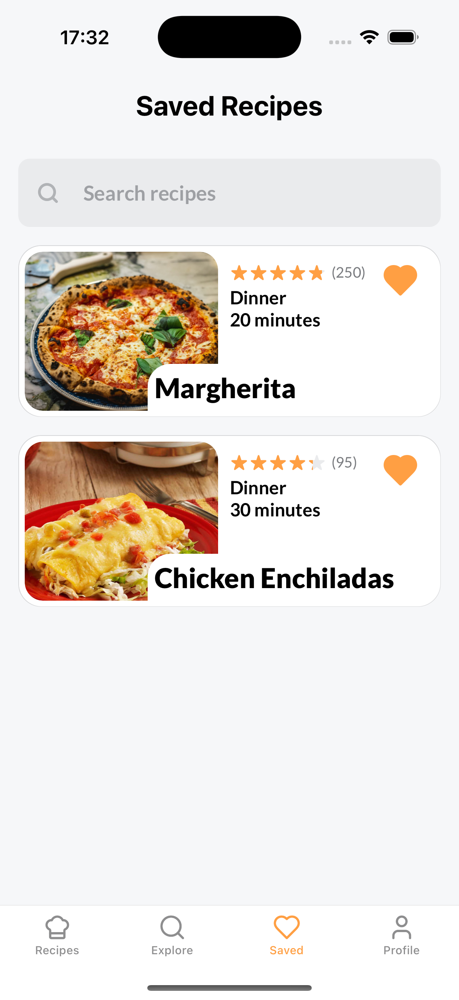
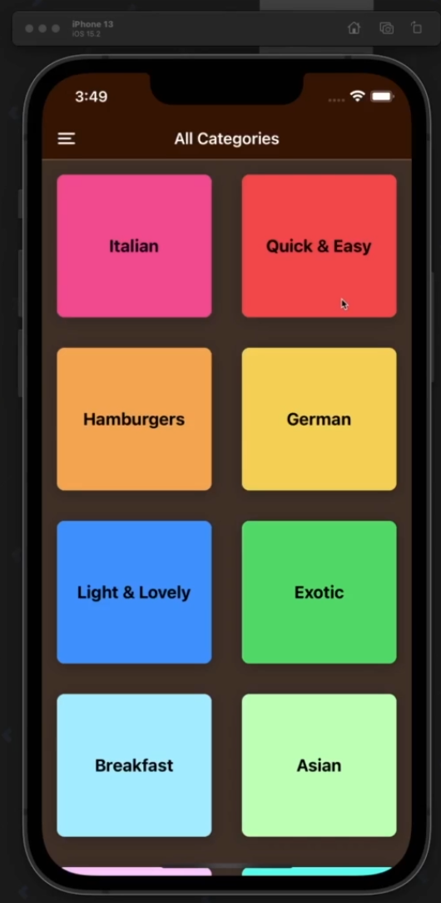

# Recipe Hub 🍳

A modern recipe management application built with React Native, TypeScript, and Expo.

This project is based on the [React Native - The Practical Guide [2025]](https://www.udemy.com/course/react-native-the-practical-guide/) course, but implemented with TypeScript.

I've grasped the idea of what needs to be done and started with implementation before watching course parts.

## Features ✨

- 📱 Cross-platform mobile app (iOS & Android)
- 🔍 Search and discover recipes
- 📋 Browse recipe categories
- 📖 View detailed recipe instructions and ingredients
- ❤️ Save favorite recipes (with Redux Persist for data persistence)
- 🌓 Modern UI with elegant design

## 📱 Screenshots

### My Version (TypeScript)

<table>
<tr>
<td><td>
<td><td>
<td><td>
</tr>
<tr>
<td><td>
<td><td>
<td><td>
</tr>
</table>

### Course Version (JavaScript)

<table>
<tr>
<td></td>
<td></td>
</tr>
</table>

## Tech Stack 🛠

- **Framework**: React Native with Expo
- **Language**: TypeScript
- **Navigation**: Expo Router
- **State Management**:
  - Redux Toolkit
  - Redux Persist with AsyncStorage
- **UI Components**:
  - Expo Vector Icons
  - Expo Blur
  - Expo Image
  - Expo Linear Gradient
  - Lucide React Native (icons)
  - React Native Reanimated Carousel
- **Animations**: React Native Reanimated
- **Gestures**: React Native Gesture Handler
- **Safe Area**: React Native Safe Area Context

## Prerequisites 📋

- Node.js (v18 or higher)
- npm or yarn
- Expo CLI
- iOS Simulator (for Mac) or Android Studio (for Android development)

## Getting Started 🚀

1. Clone the repository:

   ```bash
   git clone https://github.com/yourusername/recipe-hub.git
   cd recipe-hub
   ```

2. Install dependencies:

   ```bash
   npm install
   # or
   yarn install
   ```

3. Start the development server:

   ```bash
   npm start
   # or
   yarn start
   ```

4. Run on your preferred platform:
   ```bash
   # For iOS
   npm run ios
   # For Android
   npm run android
   # For web
   npm run web
   ```

## Project Structure 📁

```
recipe-hub/
├── app/                      # Main Expo Router screens and navigation
│   ├── (tabs)/               # Tab-based navigation screens
│   └── recipe/               # Recipe detail screen
├── assets/                   # Images, fonts, and other static assets
├── src/                      # Source code
│   ├── components/           # Reusable React components
│   │   ├── screens/          # Screen-specific components
│   │   └── ui/               # UI components (buttons, cards, etc.)
│   ├── store/                # Redux store configuration
│   │   └── slices/           # Redux slices
│   └── mock-data.ts          # Mock recipe data
│   └── styles.ts             # Global style data
```

## Available Scripts 📜

- `npm start` - Start the Expo development server
- `npm run ios` - Run the app on iOS simulator
- `npm run android` - Run the app on Android emulator
- `npm run web` - Run the app in web browser
- `npm run lint` - Run ESLint for code linting

## Implementation Details 🔧

- **Navigation**: Tab-based navigation with Expo Router
- **State Management**: Redux for global state with persistence using AsyncStorage
- **Data Flow**: Mock data for recipes with favorites functionality
- **UI Components**: Custom UI components with consistent styling
