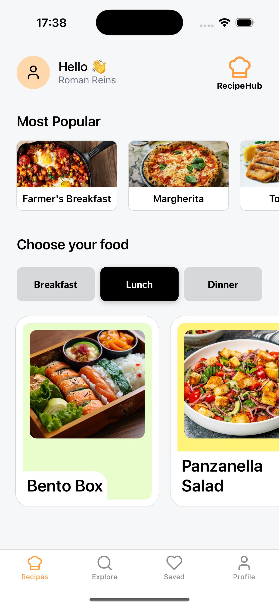

# Recipe Hub 🍳

A modern recipe management application built with React Native, TypeScript, and Expo.

This project is based on the [React Native - The Practical Guide [2025]](https://www.udemy.com/course/react-native-the-practical-guide/) course, but implemented with TypeScript.

This part covers navigation handling. As with previous projects, I've grasped the idea and started with implementation before watching course part.

## Features ✨

- 📱 Cross-platform mobile app (iOS & Android)
- 🔍 Search and discover recipes
- 💾 Save favorite recipes (maybe later)
- 📝 Create and manage your own recipes (maybe later)
- 🎨 Modern UI with smooth animations

## 📱 Screenshots

### My Version (TypeScript)

<table>
<tr>
<td><td>
<td><td>
<td><td>

</tr>
</table>

### Course Version (JavaScript)

<table>
<tr>
<td></td>
<td></td>
</tr>
</table>

## Tech Stack 🛠

- **Framework**: React Native with Expo
- **Language**: TypeScript
- **Navigation**: Expo Router
- **UI Components**:
  - Expo Vector Icons
  - Expo Blur
  - Expo Image
- **Animations**: React Native Reanimated
- **Gestures**: React Native Gesture Handler
- **Safe Area**: React Native Safe Area Context

## Prerequisites 📋

- Node.js (v18 or higher)
- npm or yarn
- Expo CLI
- iOS Simulator (for Mac) or Android Studio (for Android development)

## Getting Started 🚀

1. Clone the repository:

   ```bash
   git clone https://github.com/yourusername/recipe-hub.git
   cd recipe-hub
   ```

2. Install dependencies:

   ```bash
   npm install
   # or
   yarn install
   ```

3. Start the development server:

   ```bash
   npm start
   # or
   yarn start
   ```

4. Run on your preferred platform:
   ```bash
   # For iOS
   npm run ios
   # For Android
   npm run android
   # For web
   npm run web
   ```

## Project Structure 📁

```
recipe-hub/
├── app/              # Main application code
├── assets/           # Images, fonts, and other static assets
├── components/       # Reusable React components
├── constants/        # App-wide constants and configuration
├── hooks/           # Custom React hooks
├── services/        # API and other external services
├── types/           # TypeScript type definitions
└── utils/           # Utility functions and helpers
```

## Available Scripts 📜

- `npm start` - Start the Expo development server
- `npm run ios` - Run the app on iOS simulator
- `npm run android` - Run the app on Android emulator
- `npm run web` - Run the app in web browser
- `npm run lint` - Run ESLint for code linting
